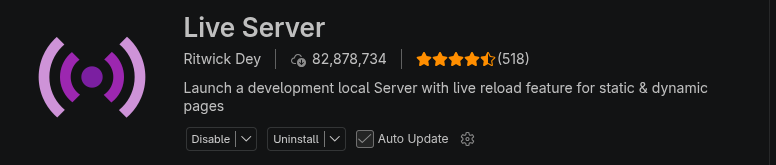

# site-statique

## objectif

- Site vitrine statique (HTML + CSS) pour l'agence fictive **Zebb** — café & branding.

### Une seule page avec les sections :

<ul>
    <li>Hero</li>
    <li>About</li>
    <li>Services</li>
    <li>Customers</li>
    <li>Team</li>
    <li>Portfolio</li>
    <li>Testimonials</li>
    <li>Contact</li>
    <li>Newsletter</li>
    <li>Footer</li>
</ul>

## technologies utilisées

- Visual Studio Code (CSS et HTML)
- Terminal
- Chromium

## Lien vers la maquette Figma

[Lien](https://www.figma.com/design/hBEZzHTFVCaTCK2AcNcYva/DEV---Site-Statique?node-id=1-66&p=f)

# Comment ouvrir le site

## 1. Télécharger les fichiers du projet

Pour que le site fonctionne, il faut **tous** les fichiers suivants, en respectant l'arborescence :

- `index.html` — la page principale

- `css/style.css` — la feuille de style

- le dossier `Desktop/` — qui contient **toutes les images et icônes**

  (logo, illustrations, photos, flèches, icônes de réseaux sociaux…)

- `README.md` — ce fichier

> ⚠️ Important : les chemins des images dans `index.html` sont **relatifs** (`./Desktop/...`).
> Si tu déplaces les images ailleurs, ou si tu renommes le dossier, les images ne s'afficheront plus.

## 2. Installer les outils nécessaires

Avant de lancer le site, il faut installer :
1. **Visual Studio Code** — l'éditeur de code
2. **L'extension Live Server** dans VS Code
   
   Elle permet de lancer le site dans le **navigateur** et de **recharger automatiquement** la page à chaque modification.
3. **Un navigateur récent** — Chromium, Chrome, Firefox ou Edge.
## 3. Installer Live Server dans VS Code
1. Ouvre **VS Code**.
2. Va dans l'onglet **Extensions** (icône de carrés à gauche, ou raccourci `Ctrl+Shift+X`).
3. Dans la barre de recherche, tape **`Live Server`**.
4. Choisis l'extension **Live Server** et clique sur **Install**.
## 4. Ouvrir le projet dans VS Code
1. Lance **VS Code**.
2. Menu **Fichier** → **Ouvrir le dossier…** (`Ctrl+K` puis `Ctrl+O`).
3. Sélectionne le dossier `site-statique` (celui qui contient `index.html`, `css/` et `Desktop/`).
## 5. Lancer le site
1. Dans l'explorateur de fichiers à gauche, repère le fichier **`index.html`**.
2. Fais un **clic droit** dessus.
3. Choisis **« Open with Live Server »**.
   *(Alternative : clique sur le bouton **« Go Live »** en bas à droite de la barre d'état de VS Code.)*
4. Le navigateur s'ouvre automatiquement sur une adresse du type :
